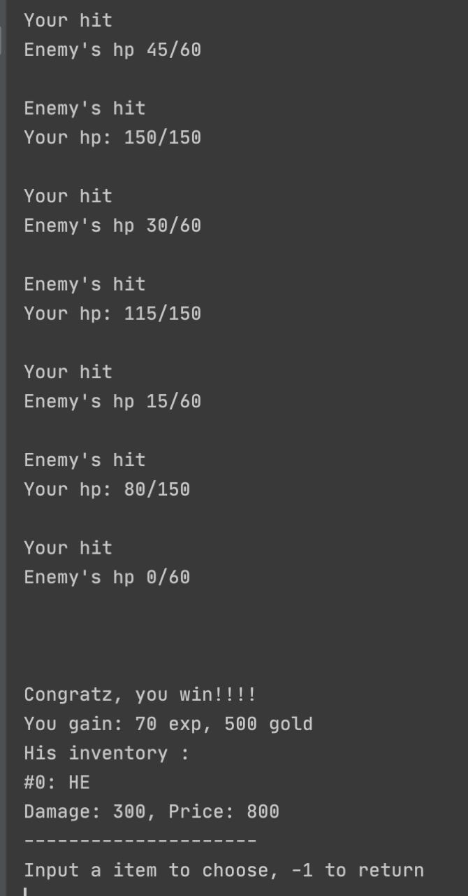
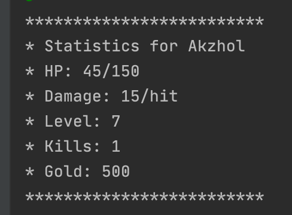

Technical Specification
Creation of new character

In the beginning you have three choices, to start a new game, to start a saved game and to exit. 
The saved games, it is just option that we may add to game in the future. 
It will save information of every main character that is created before in the game.
When you choose the first one you should create main character for the game with maximum hp, hp, name, attack, experience, level, gold.
Then main character can choose what to do next. There are 7 choices. Notice that in every selection has option going back or quit.

1.Map: Where he can go to some cities to struggle with other strong characters, 
Firstly, there is a country. Here you will choose the city, then also enemies in cities. 
And if you win the enemy, main character will level up, gain experience and gold. 
Also, you can take the weapons of enemy by adding to inventory.

2.Inventory: Shows inventory of character.  And character can store only best 3 items. 
Also, each item has damage, depending on this damage the price will increase. Item from inventory increases total damage of a character.

3.Statistics: Shows statistics. It’s just showing information about main character. HP, gold, damage and other stuff.

4.Shop. Here character can buy weapon by his golds. As written before inventory can store only 3 items.

5.Work. By working he can earn the golds. It doesn’t have any job, character just works and getting money.

6.Go home. go home to relax and restore hp. 

7.Quit.

Classes:
Application:
Application it is a class where all logic located. Main menu, fighting and other stuff.

Character:
Character is class which stores information and methods of characters. Information like hp, damage and other.
Methods like add item to inventory, show Statistics, check if we may level up, etc.

Item:
It’s information about weapon. We store fields like name, damage, and price.

Country:
In this class we store a name of country and a list of cities.

City:
In the city we store name and citizens just like in country class, also there are a method to show information about city and add citizens to it.

Codes:
You can find all codes in this repository

Provide 4 screenshots:

  
  

